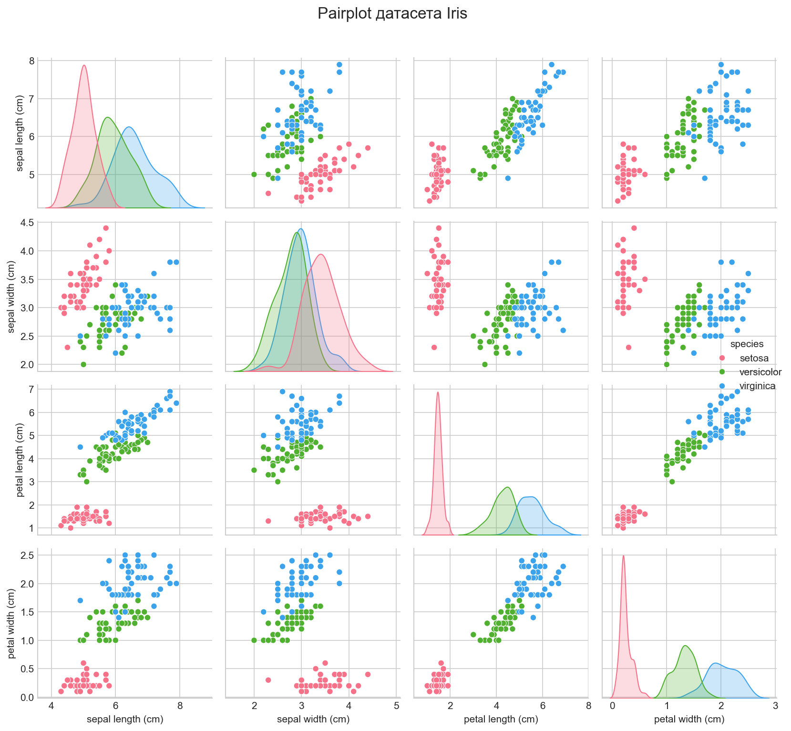
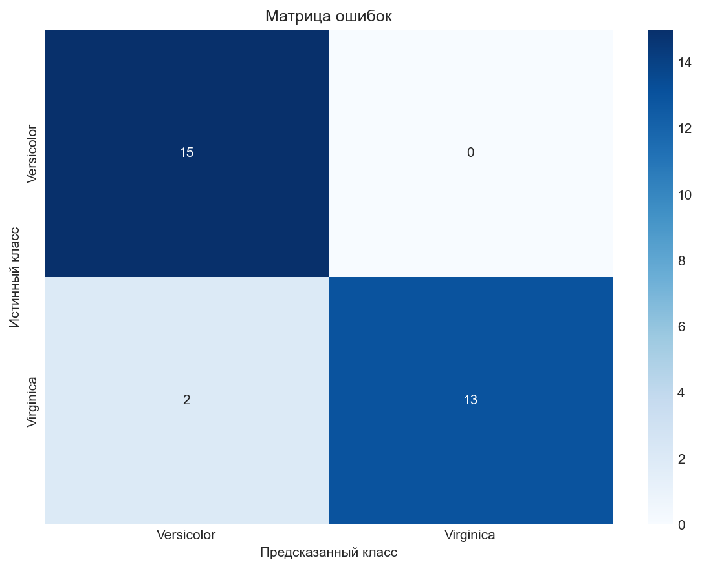
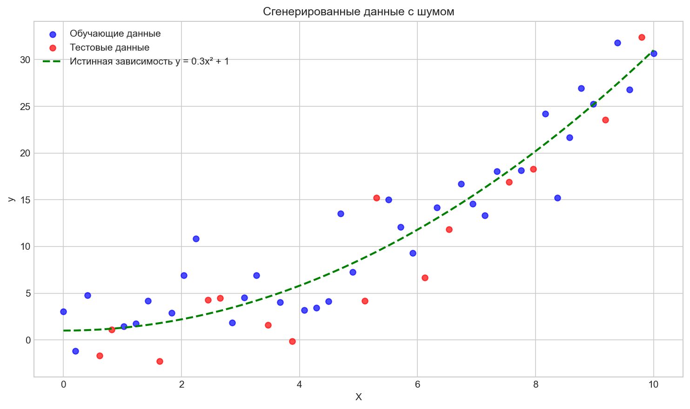
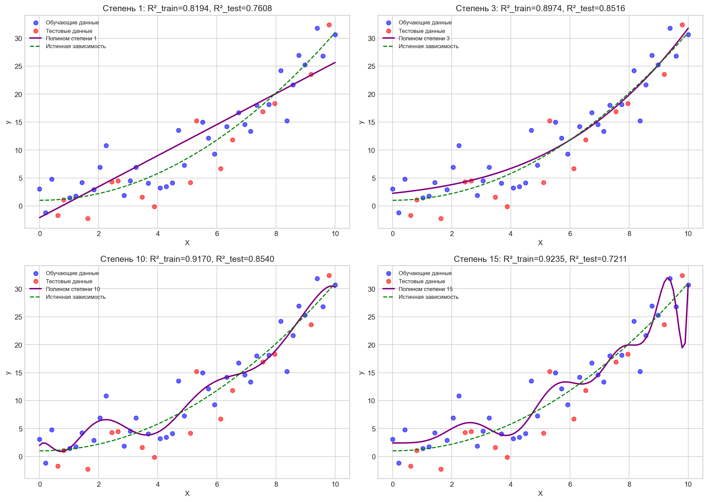

# Отчёт по лабораторной работе №1

## Титульный лист

**Название лабораторной работы**: Основы машинного обучения (Lab1)

**Студент**: [ФИО]

**Номер студенческого билета**: [Номер]

**Преподаватель**: [ФИО]

**Дата提交**: Март 2026

**Ссылка на Git-репозиторий**: [Ссылка]

---

## 1. Цель работы

Освоить базовые понятия машинного обучения, настроить пайплайн работы с git, изучить генерацию случайной выборки и борьбу с переобучением.

**Ссылка на Git-репозиторий**: [Ссылка]

---

## 2. Ответы на теоретические вопросы

### Вопрос 1: В чём состоит основная проблема переобучения?

**Ответ**: Переобучение (overfitting) — это ситуация, когда модель слишком хорошо запоминает обучающие данные, включая шум и случайные колебания, вместо того чтобы выявлять общие закономерности. Основные проблемы:

- Модель становится слишком сложной и запоминает шум в данных
- Модель теряет способность обобщать знания на новые, не виденные данные
- Плохая предсказательная способность на новых данных

### Вопрос 2: Почему мы не можем оценивать качество модели на тех данных, на которых она обучалась?

**Ответ**: Потому что модель уже видела эти данные в процессе обучения и могла их "запомнить". Оценка качества на обучающих данных даёт слишком оптимистичную оценку. Для реальной оценки необходимо использовать тестовые данные, которые модель не видела в процессе обучения.

### Вопрос 3: Что такое регуляризация и как она помогает бороться со сложностью модели?

**Ответ**: Регуляризация — это техника добавления штрафа за сложность модели к функции потерь. Основные виды:

- **L1 регуляризация (Lasso)**: добавляет L1 норму вектора весов, что может обнулить некоторые веса (выбор признаков)
- **L2 регуляризация (Ridge)**: добавляет L2 норму вектора весов, приближая веса к нулю

Регуляризация ограничивает веса модели, не позволяя им становиться слишком большими, что уменьшает переобучение.

---

## 3. Результаты экспериментов

### Задание 1: Загрузка и визуализация датасета Iris

**Описание датасета**:
- Источник: встроенный датасет Iris из библиотеки sklearn
- Количество образцов: 150
- Количество признаков: 4 (длина чашелистика, ширина чашелистика, длина лепестка, ширина лепестка)
- Количество классов: 3 (Setosa, Versicolor, Virginica)

**Статистическое описание**:
| Признак | Среднее | Ст. отклонение | Мин | Макс |
|---------|---------|----------------|-----|------|
| Длина чашелистика (см) | 5.84 | 0.83 | 4.3 | 7.9 |
| Ширина чашелистика (см) | 3.05 | 0.44 | 2.0 | 4.4 |
| Длина лепестка (см) | 3.76 | 1.77 | 1.0 | 6.9 |
| Ширина лепестка (см) | 1.20 | 0.76 | 0.1 | 2.5 |

**Анализ визуализации**:
С помощью pairplot можно наблюдать:
- Три вида ирисов чётко разделяются в пространстве признаков
- Длина и ширина лепестка лучше всего разделяют классы
- Длина и ширина чашелистика имеют некоторое перекрытие между классами

### Задание 2: Логистическая регрессия для бинарной классификации

**Экспериментальная установка**:
- Классификация: Versicolor против Virginica
- Разделение данных: 70% обучение, 30% тест
- Случайное зерно: 42 (для воспроизводимости)

**Производительность модели**:
| Метрика | Значение |
|---------|----------|
| Точность на обучающей выборке | 95.71% |
| Точность на тестовой выборке | 93.33% |

**Отчёт по классификации**:
| Класс | Precision | Recall | F1-Score | Support |
|-------|-----------|--------|----------|---------|
| Versicolor | 0.88 | 1.00 | 0.94 | 15 |
| Virginica | 1.00 | 0.87 | 0.93 | 15 |

**Вывод**: Малая разница в точности между обучающей и тестовой выборками (всего 2.38%) показывает, что модель обладает хорошей обобщающей способностью и не демонстрирует переобучения.

*Рис: Матрица ошибок логистической регрессии на тестовой выборке*

### Задание 3: Демонстрация недообучения и переобучения

**Экспериментальная установка**:
- Истинная зависимость: y = 0.3x² + 1 (нелинейная)
- Добавленный шум: среднее 0, стандартное отклонение 3
- Количество образцов: 50
- Разделение обучение/тест: 70%/30%

**Сравнение моделей**:

| Степень полинома | R² обучение | R² тест | Разница | Состояние |
|------------------|-------------|----------|---------|-----------|
| 1 | 0.8194 | 0.7608 | 0.0587 | Недообучение |
| 3 | 0.8974 | 0.8516 | 0.0459 | Хорошо |
| 10 | 0.9170 | 0.8540 | 0.0630 | Хорошо |
| 15 | 0.9235 | 0.7211 | 0.2024 | Переобучение |

**Анализ визуализации**:

*Рис: Сгенерированные синтетические данные (синий - обучающая выборка, красный - тестовая выборка, зелёная пунктирная линия - истинная зависимость y=0.3x²+1)*

*Рис: Сравнение эффектов подбора при разных степенях полинома*

- **Степень 1 (Недообучение)**: Линейная модель не может уловить нелинейную зависимость; модель слишком простая
- **Степень 3-10 (Хорошо)**: Модель достаточно хорошо аппроксимирует истинную зависимость
- **Степень 15 (Переобучение)**: Модель слишком сложная, начинает подстраиваться под шум, показывает значительное ухудшение на тестовой выборке

---

## 4. Выводы

1. **Анализ датасета Iris**: С помощью визуализации pairplot мы успешно показали распределение признаков и межклассовые соотношения. Признаки лепестка являются ключевыми для разделения видов ирисов.

2. **Классификация логистической регрессией**: Используя логистическую регрессию для бинарной классификации Versicolor и Virginica, мы достигли точности 93.33% на тестовой выборке, что демонстрирует хорошую обобщающую способность модели.

3. **Недообучение и переобучение**:
   - Недообучение происходит, когда модель слишком проста для улавливания сложных закономерностей в данных
   - Переобучение происходит, когда модель слишком сложная и запоминает шум в обучающих данных
   - Оптимальная сложность модели находится в балансе между недообучением и переобучением

4. **Важность регуляризации**: Техники регуляризации могут эффективно предотвращать переобучение и улучшать обобщающую способность модели путём наложения штрафа на сложность модели.

---

## 5. Приложение

### Сгенерированные визуализационные диаграммы

1. `iris_pairplot.png` — Pairplot датасета Iris
2. `confusion_matrix.png` — Матрица ошибок логистической регрессии
3. `generated_data.png` — Сгенерированные синтетические данные
4. `overfitting_demo.png` — Демонстрация недообучения и переобучения
